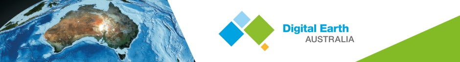
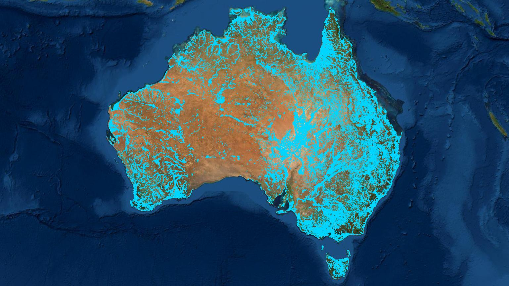

Digital Earth Australia Waterbodies
#################################

.. image:: https://img.shields.io/badge/License-Apache%202.0-blue.svg
  :target: https://opensource.org/licenses/Apache-2.0
  :alt: Digital Earth Australia logo
  
.. image:: https://github.com/GeoscienceAustralia/dea-waterbodies/actions/workflows/lint.yml/badge.svg
  :target: https://github.com/GeoscienceAustralia/dea-waterbodies/actions/workflows/lint.yml
  :alt: Linting status
  
.. image:: https://github.com/GeoscienceAustralia/dea-waterbodies/actions/workflows/test.yml/badge.svg
  :target: https://github.com/GeoscienceAustralia/dea-waterbodies/actions/workflows/test.yml
  :alt: Testing status

**License:** The code in this repository is licensed under the `Apache License, Version 2.0 <https://www.apache.org/licenses/LICENSE-2.0>`_. Digital Earth Australia data is licensed under the `Creative Commons by Attribution 4.0 license <https://creativecommons.org/licenses/by/4.0/>`_.

**Contact:** If you need assistance with any of the Jupyter Notebooks or Python code in this repository, please post a question on the `Open Data Cube Slack channel <http://slack.opendatacube.org/>`_. If you would like to report an issue with this repo, or suggest feature requests, you can `open an issue on this repository <https://github.com/GeoscienceAustralia/dea-waterbodies/issues>`_.

Up to date information about the extent and location of surface water provides all Australians with a common understanding of this valuable and increasingly scarce resource.

Digital Earth Australia Waterbodies shows the wet surface area of waterbodies as estimated from satellites. It does not show depth, volume, purpose of the waterbody, nor the source of the water.

Digital Earth Australia Waterbodies uses Geoscience Australia’s archive of over 30 years of Landsat satellite imagery to identify where almost 300,000 waterbodies are in the Australian landscape and tells us the wet surface area within those waterbodies.

It supports users to understand and manage water across Australia. For example, users can gain insights into the severity and spatial distribution of drought, or identify potential water sources for aerial firefighting during bushfires.

The tool uses a `water classification <https://www.ga.gov.au/dea/products/wofs>`_ for every available Landsat satellite image and maps the locations of waterbodies across Australia. It provides a time series of wet surface area for waterbodies that are present more than 10% of the time and are larger than 3125m2 (5 Landsat pixels).

The tool indicates changes in the wet surface area of waterbodies. This can be used to identify when waterbodies are increasing or decreasing in wet surface area.

Installation
------------

DEA Waterbodies has some requirements which can be installed with pip:

.. code-block:: bash

    pip install --extra-index-url="https://packages.dea.ga.gov.au" -r requirements.txt

*Digital Earth Australia Waterbodies. Waterbody polygons mapped by this product are shown in blue. There are almost 300,000 across Australia.*
